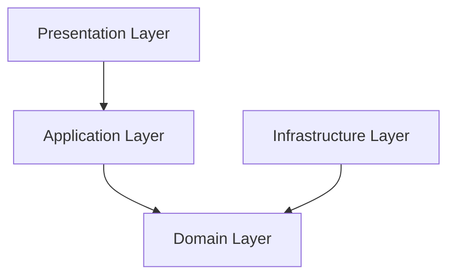

# System Architecture

The MAO Admin Panel is built upon the principles of **Clean Architecture**. This architectural style emphasizes the separation of concerns, creating a system that is independent of frameworks, UI, and databases. This approach leads to a more maintainable, scalable, and testable codebase.

## Architectural Layers

The application is divided into four distinct layers, with a strict dependency rule: outer layers can depend on inner layers, but inner layers cannot depend on outer layers.

### 1. Domain Layer (Inner Core)

This is the heart of the application. It contains the core business logic, entities, and rules that are independent of any other part of the system.

- **Entities**: Core business objects (e.g., `User`, `Task`).
- **Value Objects**: Objects representing descriptive aspects of the domain (e.g., `Email`, `Password`).
- **Interfaces (Repositories/Services)**: Defines the contracts that the outer layers must implement. This layer dictates the behavior but not the implementation.
- **DTOs (Data Transfer Objects)**: Simple objects used to carry data between layers without exposing domain entities.

### 2. Application Layer

This layer orchestrates the use cases of the application. It contains application-specific business logic and coordinates the flow of data from the presentation layer to the domain layer and back.

- **Services**: Implements the use cases by orchestrating domain entities and repositories. For example, `UserService` handles the logic for creating, updating, and retrieving users.

### 3. Infrastructure Layer

This layer is responsible for all external concerns, such as databases, API clients, and other third-party services. It implements the interfaces (repositories) defined in the Domain Layer.

- **Repositories**: Concrete implementations of the repository interfaces (e.g., `UserRepositoryImpl` which interacts with the database via an API).
- **API Clients**: Classes responsible for making HTTP requests to the backend server (e.g., `UserApi`).
- **Database Configuration**: Code for connecting to and interacting with the MongoDB database.

### 4. Presentation Layer (Outermost Layer)

This is the user-facing layer. In this project, it is a Single Page Application (SPA) built with React.

- **React Components**: Reusable UI elements that make up the user interface (e.g., `UserList`, `TaskForm`).
- **Hooks**: Custom React Hooks that encapsulate UI logic and state management (e.g., `useUsers`).
- **Pages**: Top-level components that represent different screens or views in the application.
- **Routing**: Manages navigation within the application using React Router.

## SOLID Principles

The project adheres to the SOLID principles to ensure a robust and maintainable design:

- **Single Responsibility Principle**: Each class or module has one, and only one, reason to change. For example, `UserService` handles user logic, while `UserRepository` handles user data access.
- **Open/Closed Principle**: Software entities should be open for extension but closed for modification. New features are added by creating new classes or extending existing ones, not by changing them.
- **Liskov Substitution Principle**: Subtypes must be substitutable for their base types.
- **Interface Segregation Principle**: Clients should not be forced to depend on interfaces they do not use. The project uses small, specific interfaces.
- **Dependency Inversion Principle**: High-level modules should not depend on low-level modules. Both should depend on abstractions. This is achieved through the use of interfaces and dependency injection.

## Design Patterns

- **Repository Pattern**: Abstracts the data layer, making it easier to switch data sources and test business logic independently of the database.
- **Service Layer Pattern**: Encapsulates the application's business logic in services, promoting separation of concerns.
- **Dependency Injection**: Used to provide dependencies to a class instead of having the class create them itself, promoting loose coupling.
