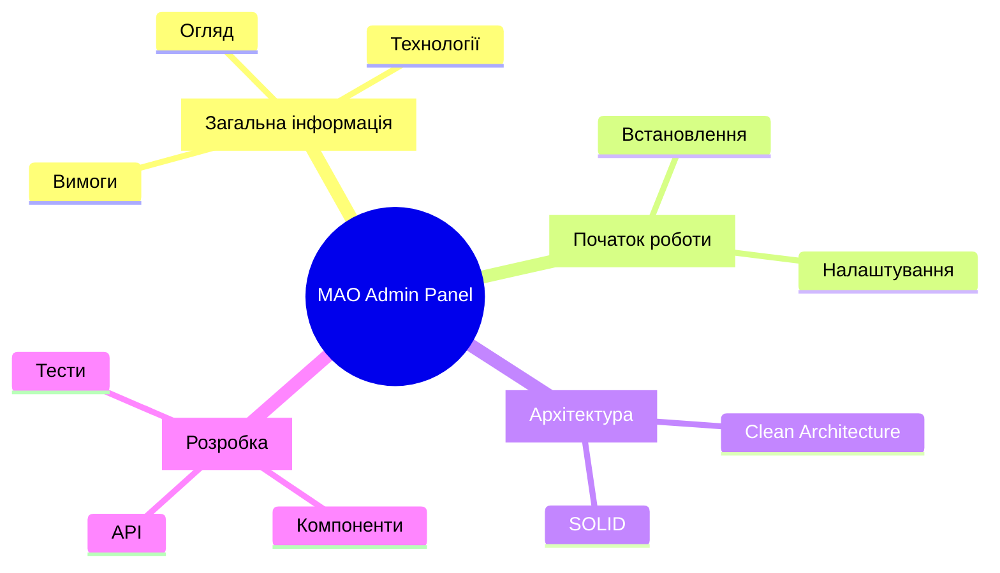
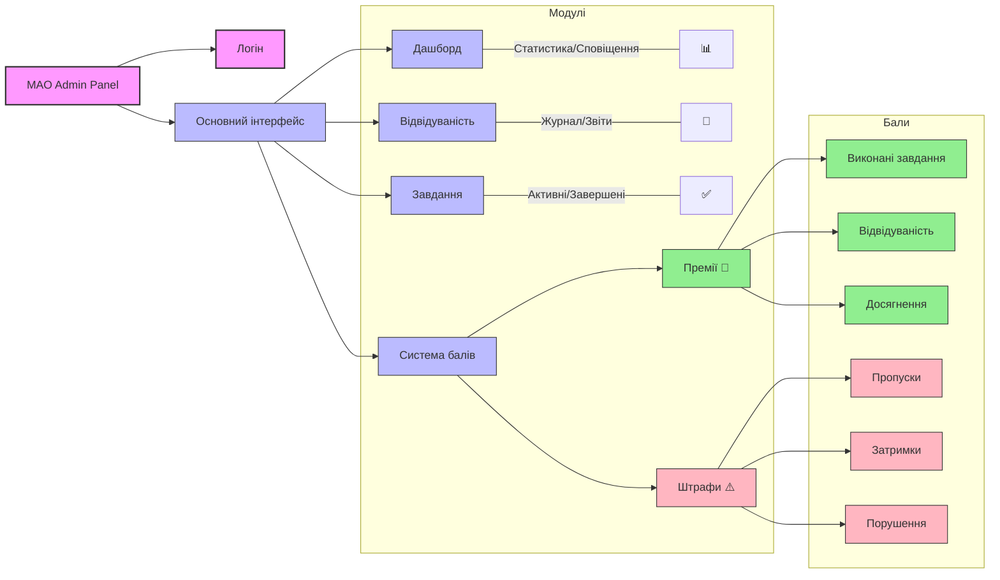
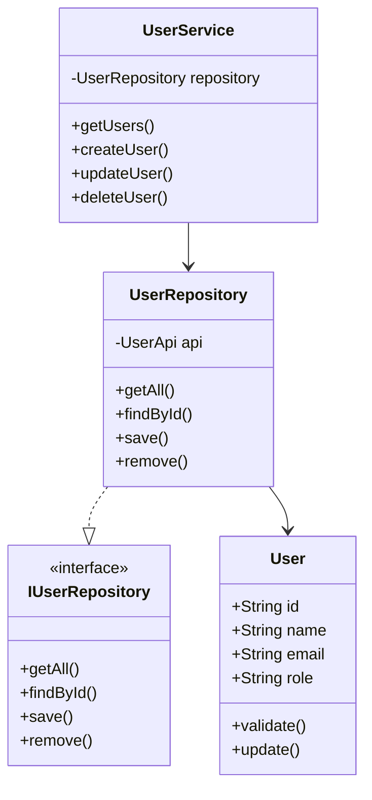
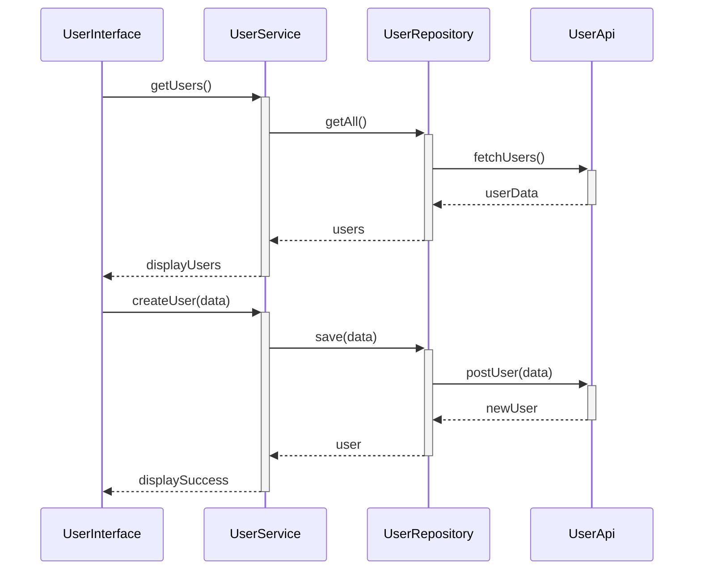

# MAO Admin Panel - Повна документація

> [!NOTE]
> Це повна документація проекту MAO Admin Panel. Вона містить всю необхідну інформацію для розробників, від архітектури до прикладів коду.

## 📋 Зміст

- [[#Загальна інформація]]
- [[#Початок роботи]]
- [[#Архітектура]]
  - [[#Domain Layer]]
  - [[#Application Layer]]
  - [[#Presentation Layer]]
- [[#Розробка]]
- [[#Структура адмін-панелі]]
- [[#UML діаграми]]
- [[#Інструкція користувача]]
- [[#Налаштування системи]]
- [[#Мобільна версія]]

---

## 📊 Загальна схема



---

## 📘 Domain Layer

> [!TIP]
> Domain Layer містить бізнес-логіку та основні сутності додатку.

### Інтерфейси

```typescript
// domain/interfaces/IUser.ts
interface IUser {
  id: string;
  name: string;
  email: string;
  role: string;
}
```

### Value Objects

```typescript
// domain/value-objects/Email.ts
class Email {
  private readonly value: string;

  constructor(email: string) {
    if (!this.isValid(email)) {
      throw new Error("Invalid email format");
    }
    this.value = email;
  }

  private isValid(email: string): boolean {
    return /^[^\s@]+@[^\s@]+\.[^\s@]+$/.test(email);
  }

  toString(): string {
    return this.value;
  }
}
```

---

## 💻 Application Layer

> [!TIP]
> Application Layer відповідає за координацію між доменним шаром та зовнішніми сервісами.

### Сервіси

```typescript
// application/services/UserService.ts
class UserService {
  constructor(private readonly userRepository: IUserRepository) {}

  async getUsers(
    pagination?: PaginationParams,
    filters?: UserFilters
  ): Promise<PaginatedResponse<IUser>> {
    return this.userRepository.getAll(pagination, filters);
  }
}
```

---

## 🎯 Presentation Layer

> [!TIP]
> Presentation Layer містить компоненти користувацького інтерфейсу та логіку відображення даних.

### Компоненти

```typescript react
// presentation/components/UserList.tsx
const UserList: React.FC = () => {
  const { users, loading, error } = useUsers();

  if (loading) return <div>Завантаження...</div>;
  if (error) return <div>Помилка: {error}</div>;

  return (
    <ul>
      {users.map((user) => (
        <li key={user.id}>{user.name}</li>
      ))}
    </ul>
  );
};
```

### Хуки

> [!NOTE]
> Користувацькі хуки допомагають керувати станом та логікою компонентів.

```typescript
// presentation/hooks/useUsers.ts
export const useUsers = () => {
  const [users, setUsers] = useState<IUser[]>([]);
  const [loading, setLoading] = useState(true);
  const [error, setError] = useState<string | null>(null);

  useEffect(() => {
    const loadUsers = async () => {
      try {
        const userService = ServiceFactory.getUserService();
        const result = await userService.getUsers();
        setUsers(result.data);
      } catch (e) {
        setError(e.message);
      } finally {
        setLoading(false);
      }
    };

    loadUsers();
  }, []);

  return { users, loading, error };
};
```

---

## 🏗 Infrastructure Layer

### Repositories

```ts title:infrastructure/repositories/UserRepository.ts
class UserRepository implements IUserRepository {
  constructor(private api: UserApi) {}

  async getAll(
    pagination?: PaginationParams,
    filters?: UserFilters
  ): Promise<PaginatedResponse<IUser>> {
    return this.api.fetchUsers(pagination, filters);
  }
}
```

## 📊 API Reference

### Endpoints

> [!example] GET /api/users
>
> ```http
> GET /api/users?page=1&limit=10
> Accept: application/json
>
> {
>     "items": [
>         {
>             "id": "1",
>             "name": "John Doe",
>             "email": "john@example.com",
>             "role": "admin"
>         }
>     ],
>     "total": 100,
>     "page": 1,
>     "totalPages": 10
> }
> ```

### Error Handling

> [!warning] Error Response Structure
>
> ```json
> {
>   "code": "VALIDATION_ERROR",
>   "message": "Invalid email format",
>   "details": {
>     "field": "email",
>     "value": "invalid-email"
>   }
> }
> ```

## 🧪 Testing

### Unit Tests

```ts title:tests/UserService.test.ts
describe("UserService", () => {
  let service: UserService;
  let repository: MockUserRepository;

  beforeEach(() => {
    repository = new MockUserRepository();
    service = new UserService(repository);
  });

  test("має отримувати користувачів", async () => {
    const users = await service.getUsers();
    expect(users).toBeDefined();
  });
});
```

## 📚 Quick Reference

### SOLID Examples

> [!tip] Single Responsibility Principle
>
> ```ts
> // ✅ Правильно: один клас - одна відповідальність
> class UserValidator {
>   validateEmail(email: string): boolean {
>     return /^[^\s@]+@[^\s@]+\.[^\s@]+$/.test(email);
>   }
> }
> ```

> [!tip] Open/Closed Principle
>
> ```ts
> // ✅ Правильно: розширення без модифікації
> interface IUserFilter {
>   apply(users: User[]): User[];
> }
>
> class RoleFilter implements IUserFilter {
>   apply(users: User[]): User[] {
>     return users.filter((user) => user.role === this.role);
>   }
> }
> ```

### Best Practices

> [!check]- DO
>
> - Використовуйте TypeScript
> - Пишіть тести
> - Документуйте код
> - Дотримуйтесь SOLID

> [!fail]- DON'T
>
> - Не використовуйте any
> - Не змішуйте шари
> - Не порушуйте інкапсуляцію
> - Не дублюйте код

---

## 📊 Структура адмін-панелі

> [!NOTE]
> MAO Admin Panel - це сучасна система управління, розроблена з використанням React та TypeScript, що забезпечує ефективне керування користувачами, завданнями та системою винагород.



### Детальний опис компонентів системи

#### 1. 🔐 Логін (`pages/Login.tsx`)

- Система автентифікації
- Управління сесіями
- Відновлення паролю
- Захист від несанкціонованого доступу

#### 2. 📊 Дашборд (`pages/Dashboard.tsx`)

- Огляд ключових метрик
- Сповіщення про важливі події
- Швидкий доступ до функцій
- Статистика в реальному часі
- Персоналізовані віджети

#### 3. 📅 Відвідуваність (`pages/Attendance.tsx`)

- Реєстрація відвідувань
- Генерація звітів
- Статистика за періодами
- Експорт даних
- Фільтрація та пошук

#### 4. ✅ Завдання (`pages/Tasks.tsx`)

- Створення та редагування завдань
- Призначення виконавців
- Відстеження прогресу
- Встановлення пріоритетів
- Система сповіщень
- Категоризація

#### 5. 🏆 Винагороди (`pages/Rewards.tsx`)

- Система балів
- Управління досягненнями
- Історія нарахувань
- Рейтинги користувачів
- Аналітика прогресу

### Технічна реалізація

#### Компоненти та логіка

- `MainLayout.tsx` - основний layout додатку
- `Layout.tsx` - компонент для структурування сторінок
- Сервіси в `application/services`
- API взаємодія через `infrastructure/api`
- Стан додатку в `presentation/hooks`

#### Маршрутизація

```typescript
// pages/index.ts
export const routes = {
  login: "/login",
  dashboard: "/",
  attendance: "/attendance",
  tasks: "/tasks",
  rewards: "/rewards",
};
```

#### Інтеграції

- Автентифікація та авторизація
- API взаємодія
- Сповіщення в реальному часі
- Експорт даних
- Аналітика

### Взаємодія компонентів

> [!TIP]
> Архітектура системи побудована за принципами Clean Architecture:

1. **Потік даних**

   ```
   UI Components -> Hooks -> Services -> Repositories -> API
   ```

2. **Обробка подій**

   ```
   User Action -> Event Handler -> Service -> Repository -> API -> Update State
   ```

3. **Оновлення UI**
   ```
   State Change -> React Updates -> Re-render Components
   ```

---

## 📐 UML діаграми

### Діаграма класів



### Діаграма взаємодії



---

## 📖 Інструкція користувача

> [!TIP]
> Цей розділ містить покрокові інструкції для користувачів системи.

### 1. Вхід в систему

1. Відкрийте браузер та перейдіть за адресою системи
2. Натисніть кнопку "Увійти"
3. Введіть свої облікові дані:
   - Email
   - Пароль
4. Натисніть "Підтвердити"

### 2. Навігація по системі

- Використовуйте головне меню для переходу між розділами
- Бокове меню містить додаткові опції та налаштування
- Швидкі дії доступні через панель інструментів зверху

### 3. Робота з товарами

> [!NOTE]
> Основні операції з управління товарами

#### Додавання товару

1. Перейдіть у розділ "Товари"
2. Натисніть "Додати новий"
3. Заповніть форму:
   - Назва
   - Опис
   - Ціна
   - Категорія
4. Завантажте фотографії
5. Натисніть "Зберегти"

#### Редагування товару

1. Знайдіть товар у списку
2. Натисніть кнопку "Редагувати"
3. Внесіть необхідні зміни
4. Збережіть зміни

### 4. Управління галереєю

1. Перейдіть у розділ "Галерея"
2. Для додавання:
   - Натисніть "Завантажити"
   - Виберіть файли
   - Додайте опис
3. Для видалення:
   - Виберіть фото
   - Натисніть "Видалити"

### 5. Робота з відгуками

1. Перегляд відгуків:
   - Перейдіть у розділ "Відгуки"
   - Використовуйте фільтри для пошуку
2. Модерація:
   - Перевірте новий відгук
   - Підтвердьте або відхиліть
   - Додайте коментар при необхідності

---

## 🔧 Налаштування системи

> [!IMPORTANT]
> Важливі налаштування для оптимальної роботи системи

### Системні вимоги

- Браузер: Chrome 80+, Firefox 75+, Safari 13+
- Роздільна здатність екрану: мінімум 1280x720
- Стабільне інтернет-з'єднання: від 1 Мбіт/с

### Оптимізація продуктивності

1. Кешування даних
2. Стиснення зображень
3. Lazy loading для важкого контенту
4. Оптимізація запитів до бази даних

---

## 📱 Мобільна версія

> [!TIP]
> Особливості роботи з мобільною версією системи

1. Адаптивний дизайн
2. Оптимізовані зображення
3. Спрощена навігація
4. Touch-friendly інтерфейс
